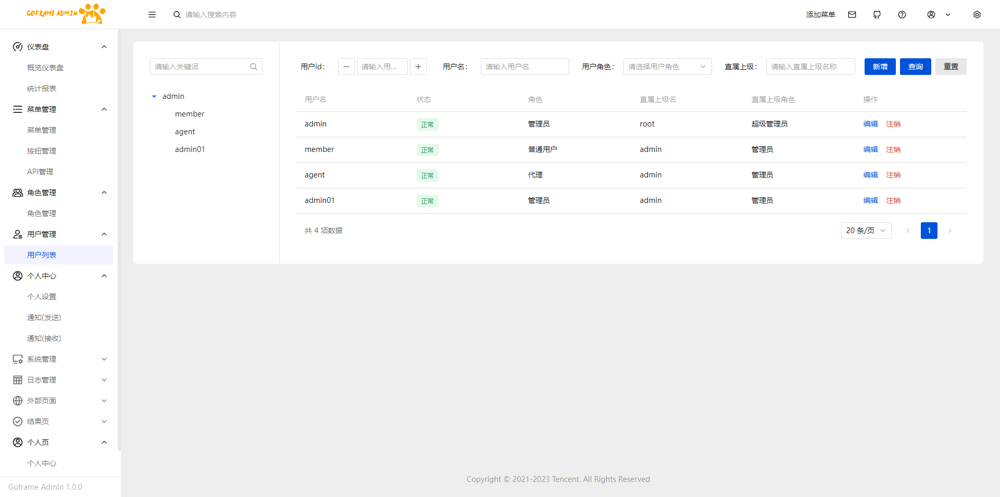
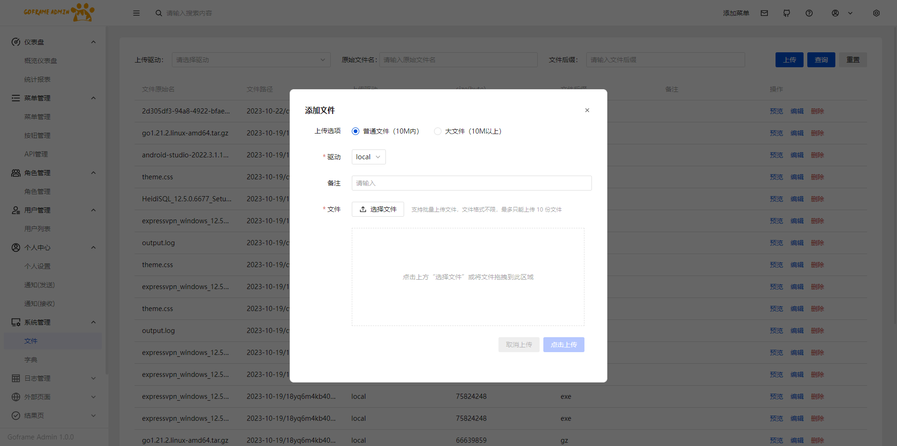

# goframe-admin
<div align="center">
    
    <p style="font-size: 28px;text-align: center">goframe-admin V1.0.0</p>
    <p align="center">
        <a href="https://goframe.org/pages/viewpage.action?pageId=1114119" target="_blank">
	        
	    </a>
	    <a href="https://v3.vuejs.org/" target="_blank">
	        
	    </a>
	    <a href="https://github.com/Tencent/tdesign-vue-next" target="_blank">
	        
	    </a>
		<a href="https://www.tslang.cn/" target="_blank">
	        
	    </a>
		<a href="https://vitejs.dev/" target="_blank">
		    
		</a>
		<a href="https://gitee.com/lyt-top/vue-next-admin/blob/master/LICENSE" target="_blank">
		    
		</a>
	</p>
</div>

## 平台简介
* 基于[goframe2.5.4](https://goframe.org/pages/viewpage.action?pageId=1114119)、[vue3](https://v3.vuejs.org/)、[tdesign-vue-next](https://tdesign.tencent.com/vue-next)开发的全栈前后端分离的管理系统。
* 前端采用[tdesign-vue-next-starter](https://github.com/Tencent/tdesign-vue-next-starter) 、vue3、pinia、tdesign-vue-next。

## 特征
* 高生产率：几分钟即可搭建一个后台管理系统
* 认证机制：采用gtoken的用户状态认证及casbin的权限认证，支持按钮级别的权限
* 路由模式：得益于goframe提供了规范化的路由注册方式,无需注解自动生成api文档
* 面向接口开发

## 内置功能
1.  菜单管理：包含菜单、按钮、API的管理，后端配置菜单，前端获取菜单配置动态生成路由。
2.  用户管理：用户的增删改查，整个用户列表是一个树形结构，支持上下级，管理员只能查看到自己的下级用户。
3.  字典管理：对系统中经常使用的一些较为固定的数据进行维护。
4.  文件管理：本地文件上传，通过分片上传的方式支持1G以上的大文件上传。
5.  角色管理：角色菜单权限分配、设置角色按机构进行数据范围权限划分。
6.  字典管理：对系统中经常使用的一些较为固定的数据进行维护。
7.  登录日志：系统登录日志记录查询。
8.  个人中心：包含个人资料的修改，密码修改，2FA登录设置（OTP二步校验）。
9.  消息通知：包含通知的发送以及查看。

## 演示地址
[http://admin.wxfk.one](http://admin.wxfk.one)
- 超级管理员：`root`，密码：`1`；
- 管理员：`admin`，密码：`1`；
## 配置
项目数据库文件 `resource/db.sql` 创建数据库导入后修改配置 `manifest/config/config.yaml`

database配置改成自己的数据库连接
```yaml
link: "mysql:root:123456@tcp(127.0.0.1:3306)/starter?loc=Local&parseTime=true"
```
redis部分也要改成自己的地址

## 前端部分
项目为前后端分离，前端github仓库地址：[https://github.com/apple1563/goframe-admin-ui](https://github.com/apple1563/goframe-admin-ui)

## 演示图

<table>
    <tr>
        <td></td>
        <td></td>
    </tr>
    <tr>
        <td></td>
        <td></td>
    </tr>
    <tr>
        <td></td>
        <td></td>
    </tr>
	<tr>
        <td></td>
        <td></td>
    </tr>
</table>

## 感谢(排名不分先后)
> goframe [https://github.com/gogf/gf](https://github.com/gogf/gf)
>
> tdesign-vue-next-starter [https://github.com/Tencent/tdesign-vue-next-starter](https://github.com/Tencent/tdesign-vue-next-starter)
>
> gtoken [https://github.com/goflyfox/gtoken](https://github.com/goflyfox/gtoken)
>
> casbin [https://github.com/casbin/casbin](https://github.com/casbin/casbin)


